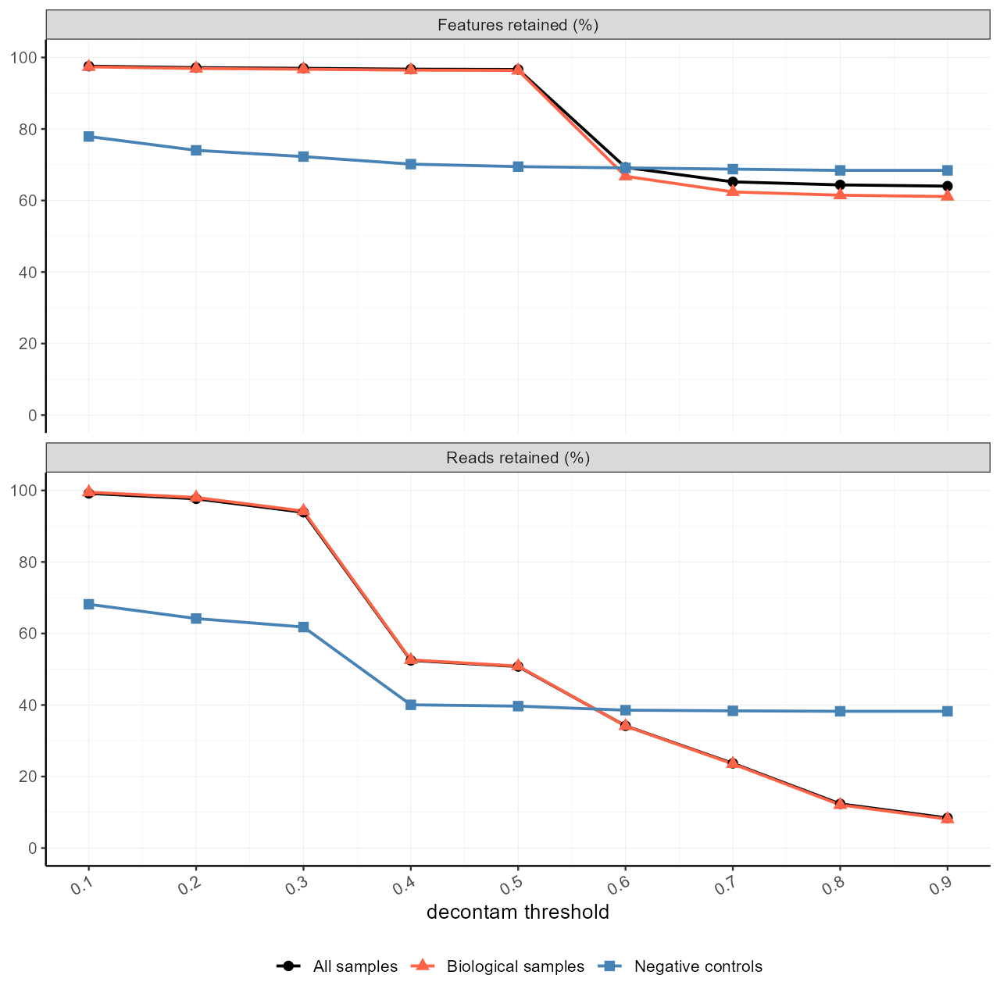
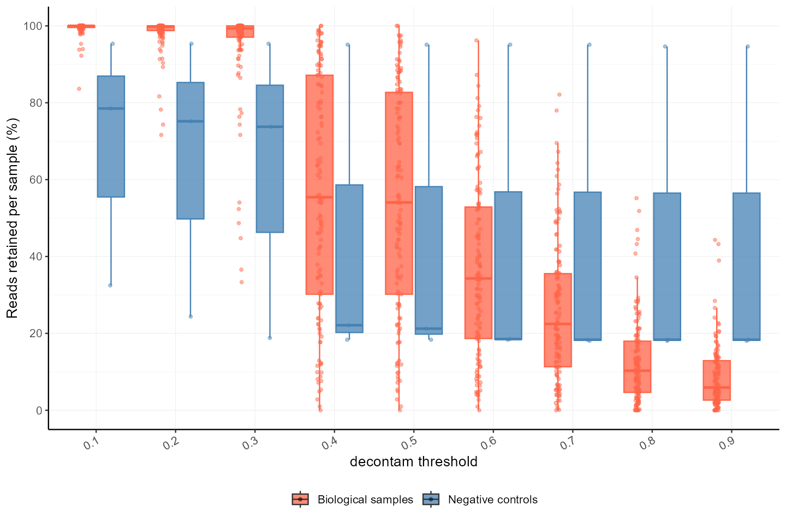
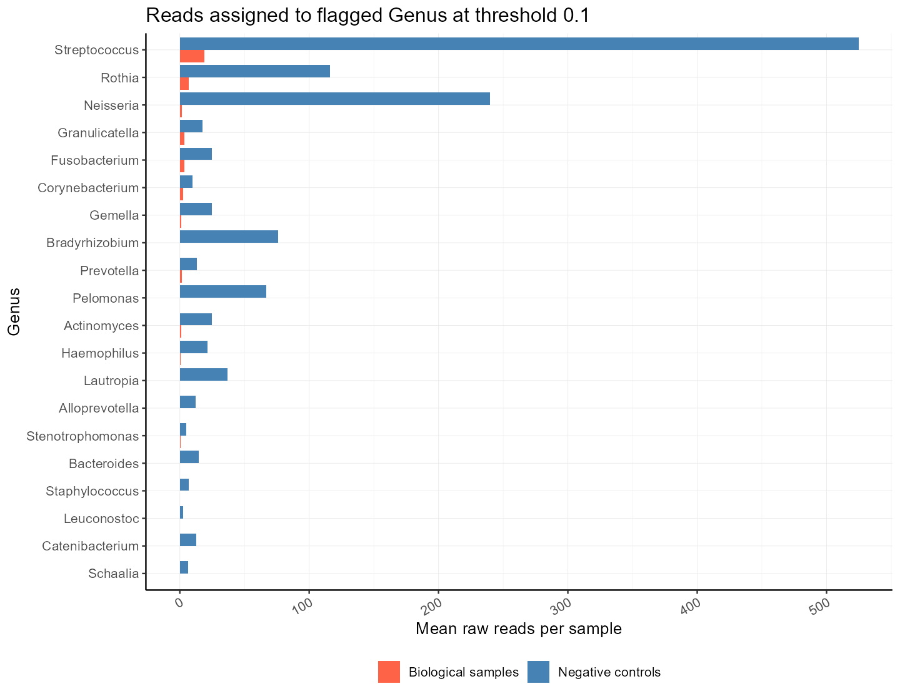
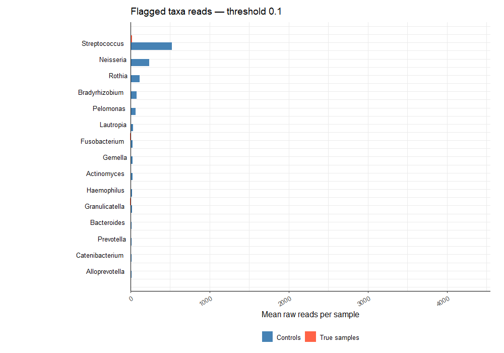

# decontamSensitivity

`decontamSensitivity` is a QC companion to
[`decontam`](https://github.com/benjjneb/decontam) for evaluating how candidate
prevalence thresholds affect microbiome data. It reports read, feature, and
sample retention; summarizes flagged taxa; and creates threshold-specific QC
plots without automatically selecting an optimal threshold.

## Installation

Install the latest GitHub version with
[`pak`](https://pak.r-lib.org/):

```r
install.packages("pak") # Run once if pak is not installed
pak::pak("KitHubb/decontamSensitivity?reinstall")

library(decontamSensitivity)
packageVersion("decontamSensitivity")
```

Restart R before reinstalling if the package is already loaded. The required
packages, including `decontam`, `phyloseq`, `ggplot2`, and `RColorBrewer`, are
declared as dependencies.

## Quick Start

`run_decontam_qc()` runs the complete workflow for every value supplied to
`thresholds`. A selected or optimal threshold is not chosen automatically.
The integrated phyloseq runner currently fits the `decontam` **prevalence**
method. Frequency scores can still be compared with the lower-level workflow
shown under [Other Functions](#compare-frequency-method-thresholds).

The input must be a `phyloseq` object with a sample-data column that identifies
negative controls. OTU tables in either `taxa × samples` or `samples × taxa`
orientation are handled through the `phyloseq` accessors.

```r
library(phyloseq)
library(decontamSensitivity)

qc <- run_decontam_qc(
  ps = ps,
  control_column = "sample_type",
  control_label = "control",
  thresholds = seq(0.1, 0.9, by = 0.1),
  taxonomy = "Genus",
  group_colors = c(
    total = "black",
    biological = "tomato",
    control = "steelblue"
  ),
  progress = TRUE
)

qc
```

The returned object contains the complete model result, tables, plots, and one
filtered `phyloseq` object per threshold.

```r
# Summary tables
qc$tables$threshold_summary
qc$tables$sample_retention_summary
qc$tables$library_size_summary
qc$tables$flagged_features
qc$tables$flagged_taxa
qc$tables$prevalence_enrichment

# Core plots
qc$plots$score_distribution
qc$plots$threshold_sensitivity
qc$plots$sample_retention
qc$plots$prevalence_enrichment

# Results for a particular evaluated threshold
qc$plots$flagged_taxa_reads_by_threshold[["0.5"]]
qc$plots$taxa_reads_before_after_by_threshold[["0.5"]]
ps_filtered_05 <- qc$filtered_phyloseq_by_threshold[["0.5"]]
```

Taxon colors are assigned automatically: up to 9 displayed taxa use the
RColorBrewer `Paired` palette, up to 12 use a `Set1`-based interpolated palette,
and up to 21 use `Paired` followed by `Set1`. Use `taxa_colors` to supply custom
colors. `progress` defaults to `interactive()` and can be disabled with
`progress = FALSE`.

## Other Functions

Each part of the workflow can also be run separately.

### Run the phyloseq threshold sweep

```r
result <- run_decontam_threshold_sweep(
  ps = ps,
  control_column = "sample_type",
  control_label = "control",
  thresholds = seq(0.1, 0.9, by = 0.1)
)

result$threshold_summary
```

### Summarize retention and flagged taxa

```r
summarize_read_retention(result)
summarize_feature_retention(result)
summarize_sample_read_retention(result)
summarize_flagged_taxa(result, threshold = 0.5, taxonomy = "Genus")
```

### Create individual QC plots

```r
plot_decontam_scores(result)
plot_threshold_sensitivity(result)
plot_sample_read_retention(result)
plot_flagged_taxa_reads(
  result,
  threshold = 0.5,
  taxonomy = "Genus",
  measure = "mean_per_sample"
)

plot_taxa_reads_before_after(
  ps = ps,
  result = result,
  threshold = 0.5,
  control_column = "sample_type",
  control_label = "control",
  taxonomy = "Genus"
)
```

### Filter or split a phyloseq object

```r
ps_filtered <- filter_phyloseq_at_threshold(
  ps = ps,
  result = result,
  threshold = 0.5
)

groups <- split_phyloseq_groups(
  ps = ps,
  control_column = "sample_type",
  control_label = "control"
)

groups$biological
groups$control
```

### Examine sample/control prevalence enrichment

```r
enrichment <- calculate_prevalence_enrichment(
  ps = ps,
  control_column = "sample_type",
  control_label = "control",
  prevalence_unit = "count",
  pseudocount = 0
)

head(enrichment)

plot_prevalence_enrichment(
  ps = ps,
  control_column = "sample_type",
  control_label = "control"
)
```

The legacy columns `odds.sample` and `odds.control` are prevalence ratios, not
statistical odds ratios.

### Use an existing decontam score table

```r
result <- run_threshold_sweep(
  decontam_result = decontam_scores,
  count_table = feature_counts,
  metadata = sample_metadata,
  control_column = "sample_type",
  control_label = "control",
  thresholds = seq(0.1, 0.9, by = 0.1),
  taxonomy = feature_taxonomy
)
```

### Compare frequency-method thresholds

Threshold sensitivity is also useful for the `decontam` frequency method. The
frequency model uses sample DNA concentration rather than negative-control
prevalence. First calculate detailed frequency scores with `decontam`, then
pass those scores to `run_threshold_sweep()`:

```r
frequency_scores <- decontam::isContaminant(
  ps,
  method = "frequency",
  conc = "DNA_concentration",
  threshold = 0.5,
  detailed = TRUE
)

frequency_result <- run_threshold_sweep(
  decontam_result = frequency_scores,
  count_table = as(phyloseq::otu_table(ps), "matrix"),
  metadata = as(phyloseq::sample_data(ps), "data.frame"),
  control_column = "sample_type",
  control_label = "control",
  thresholds = seq(0.1, 0.9, by = 0.1),
  taxonomy = as(phyloseq::tax_table(ps), "matrix"),
  score_column = "p"
)

frequency_result$threshold_summary
plot_threshold_sensitivity(frequency_result)
plot_sample_read_retention(frequency_result)
summarize_flagged_taxa(
  frequency_result,
  threshold = 0.5,
  taxonomy = "Genus"
)
```

`DNA_concentration` must be a positive numeric sample-data column. Although
the frequency model itself does not use negative controls, the current
`run_threshold_sweep()` interface still requires `control_column` and
`control_label` so that retention can be summarized separately for biological
samples and controls. Both groups must be present.

For frequency results, threshold, read-retention, sample-retention, flagged-taxa,
and before/after plots remain applicable. Control-prevalence enrichment is a
separate descriptive comparison and should not be interpreted as evidence used
by the frequency model.

## Interpretation

The package is a sensitivity diagnostic, not a threshold optimizer. Interpret
the outputs together rather than selecting a threshold from one plot alone.

- `threshold_sensitivity`: look for thresholds where negative-control reads
  decrease while total and biological read retention remain comparatively
  stable.
- `sample_retention`: check the distribution across individual samples. A high
  overall retention value can conceal samples with substantial read loss.
- `flagged_taxa_reads_by_threshold`: examine whether flagged taxa are enriched
  in controls or also abundant in biological samples.
- `taxa_reads_before_after_by_threshold`: check whether filtering removes
  biologically plausible dominant taxa or substantially changes sample
  composition.
- `flagged_taxa` and `flagged_features`: review the identities and biological
  read counts of removed features at every candidate threshold.

For the frequency method, also confirm that the concentration measurements are
reliable and cover a useful range. Features with decreasing abundance as total
DNA concentration increases are more consistent with the frequency-model
contamination pattern. Negative-control enrichment can support interpretation,
but it is not the quantity used to fit the frequency model.

A conservative threshold typically depletes control-associated signal while
preserving biological reads, samples, and plausible taxa. The final choice
should also consider study design, laboratory controls, expected biology, and
the intended downstream analysis.

## Published use case

The workflow was used for threshold-sensitivity assessment in a published skin
microbiome analysis:

[Scientific Reports (2026), threshold sensitivity analysis](https://www.nature.com/articles/s41598-026-62903-7#Sec17)

The following aggregated QC outputs illustrate the workflow on the published
healthy-volunteer skin microbiome analysis.

### Threshold sensitivity



### Sample-level read retention



### Flagged genus read counts



### Animated threshold comparison



See the [English HV workflow vignette](vignettes/hv-threshold-sensitivity.Rmd)
for the complete package workflow and animation code.

## Citation

`decontamSensitivity` uses contaminant scores produced by `decontam`; therefore,
analyses should cite the original `decontam` publication:

> Davis NM, Proctor DM, Holmes SP, Relman DA, Callahan BJ. Simple statistical
> identification and removal of contaminant sequences in marker-gene and
> metagenomics data. *Microbiome*. 2018;6:226.
> [https://doi.org/10.1186/s40168-018-0605-2](https://doi.org/10.1186/s40168-018-0605-2)

```bibtex
@article{Davis2018decontam,
  author  = {Davis, Nicole M. and Proctor, Diana M. and Holmes, Susan P. and
             Relman, David A. and Callahan, Benjamin J.},
  title   = {Simple statistical identification and removal of contaminant
             sequences in marker-gene and metagenomics data},
  journal = {Microbiome},
  year    = {2018},
  volume  = {6},
  pages   = {226},
  doi     = {10.1186/s40168-018-0605-2}
}
```

The installed citation information can be inspected in R:

```r
citation("decontam")
citation("decontamSensitivity")
```
