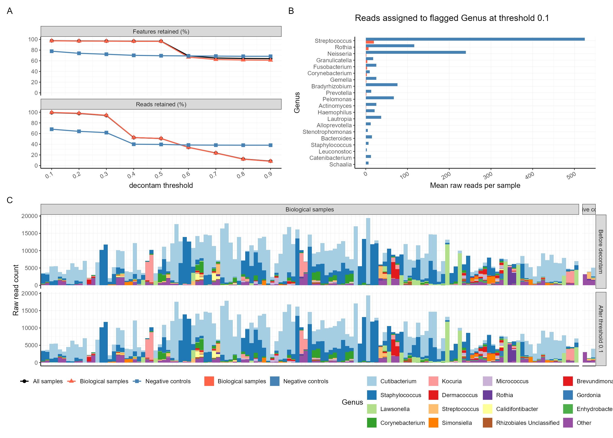
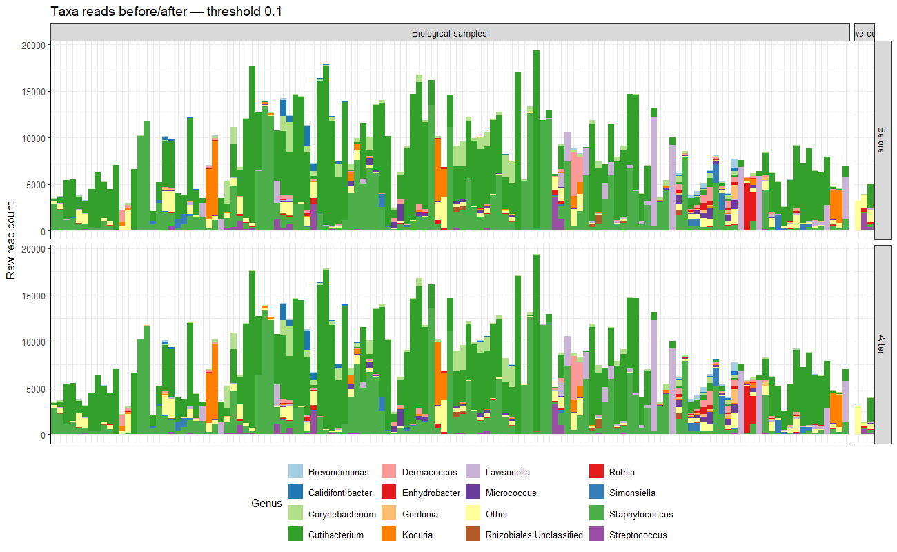

# decontamSensitivity

`decontamSensitivity` provides QC summaries and plots for comparing
`decontam` thresholds in microbiome data.

## Why decontamSensitivity?

Choosing a `decontam` threshold can be difficult in low-biomass studies because
contaminant removal may also remove biological signal.

`decontamSensitivity` helps evaluate this trade-off across multiple thresholds by asking:

- How many reads and features are retained in biological samples?
- How strongly are reads and features reduced in negative controls?
- Which taxa are affected as the threshold changes?

The package does not choose an “optimal” threshold. It provides evidence for a
choice based on the controls, expected biology, and study design.

## Installation

Install the latest version from GitHub:

```r
install.packages("pak") # Skip this if pak is already installed
pak::pak("KitHubb/decontamSensitivity")

library(decontamSensitivity)
```

## Quick Start

Run the full prevalence-based workflow with one function:

`ps` must be a `phyloseq` object containing an OTU table and sample metadata.
The metadata column supplied to `control_column` must identify the negative
controls. OTU tables work in either orientation.

```r
qc <- run_decontam_qc(
  ps = ps,
  control_column = "sample_type",
  control_label = "control",
  thresholds = seq(0.1, 0.9, by = 0.1),
  taxonomy = "Genus",
  group_colors = c(
    total = "black",
    biological = "tomato",
    control = "steelblue"
  )
)
```

```r
# Summary tables
qc$tables$threshold_summary
qc$tables$sample_retention_summary
qc$tables$flagged_taxa

# Main plots
qc$plots$threshold_sensitivity
qc$plots$sample_retention
qc$plots$prevalence_enrichment

# Results at threshold 0.5
qc$plots$flagged_taxa_reads_by_threshold[["0.5"]]
qc$plots$taxa_reads_before_after_by_threshold[["0.5"]]
ps_filtered <- qc$filtered_phyloseq_by_threshold[["0.5"]]
```

Taxon colors are chosen automatically from `RColorBrewer`. Use `taxa_colors`
to set your own.

## Other Functions

Use each step separately when you want more control.

```r
result <- run_decontam_threshold_sweep(
  ps = ps,
  control_column = "sample_type",
  control_label = "control",
  thresholds = seq(0.1, 0.9, by = 0.1)
)

summarize_read_retention(result)
summarize_feature_retention(result)
summarize_sample_read_retention(result)
summarize_flagged_taxa(result, threshold = 0.5, taxonomy = "Genus")

plot_decontam_scores(result)
plot_threshold_sensitivity(result)
plot_sample_read_retention(result)
plot_flagged_taxa_reads(result, threshold = 0.5, taxonomy = "Genus")
```

Filter the original object or split biological samples and controls:

```r
ps_filtered <- filter_phyloseq_at_threshold(ps, result, threshold = 0.5)

groups <- split_phyloseq_groups(
  ps,
  control_column = "sample_type",
  control_label = "control"
)
```

Check whether taxa are more common in biological samples or controls:

```r
enrichment <- calculate_prevalence_enrichment(
  ps,
  control_column = "sample_type",
  control_label = "control"
)

plot_prevalence_enrichment(
  ps,
  control_column = "sample_type",
  control_label = "control"
)
```

The columns `odds.sample` and `odds.control` are prevalence ratios, not odds
ratios.

### Frequency method

Threshold summaries and retention plots also work with frequency scores. See
the [frequency-method example](vignettes/hv-threshold-sensitivity.Rmd#frequency-method)
for the full workflow. The frequency model uses DNA concentration rather than
control prevalence.

## Interpretation

- `threshold_sensitivity`: look for control-associated reads to fall while
  biological reads remain stable.
- `sample_retention`: make sure a few heavily affected samples are not driving
  the overall result.
- `flagged_taxa_reads_by_threshold`: check whether flagged taxa are mainly
  found in controls.
- `taxa_reads_before_after_by_threshold`: look for unexpected changes in the
  biological community.

There is no single best threshold for every dataset. Choose one that fits your
controls, expected biology, and downstream analysis.

## Published use case

These plots come from a published healthy-volunteer skin microbiome study.

### QC overview



The package plots can be combined into one figure with `patchwork`:

```r
library(patchwork)
library(ggplot2)

p_threshold <- qc$plots$threshold_sensitivity
p_flagged <- qc$plots$flagged_taxa_reads_by_threshold[["0.1"]]
p_taxa <- qc$plots$taxa_reads_before_after_by_threshold[["0.1"]] +
  theme(
    axis.text.x = element_blank(),
    axis.ticks.x = element_blank()
  )

qc_figure <-
  (p_threshold | p_flagged) /
  p_taxa +
  plot_layout(heights = c(1, 1.15), guides = "collect") +
  plot_annotation(tag_levels = "A") &
  theme(legend.position = "bottom")

qc_figure
```

### Threshold sensitivity


### Sample read retention


### Flagged taxa


### Taxa composition



More details: [published HV case study](https://www.nature.com/articles/s41598-026-62903-7).

## Citation

Please cite `decontam`, which provides the contaminant-identification method:

> Davis NM, Proctor DM, Holmes SP, Relman DA, Callahan BJ. Simple statistical
> identification and removal of contaminant sequences in marker-gene and
> metagenomics data. *Microbiome*. 2018;6:226.
> [https://doi.org/10.1186/s40168-018-0605-2](https://doi.org/10.1186/s40168-018-0605-2)

```r
citation("decontam")
```
